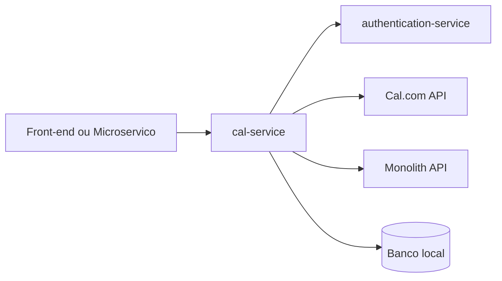
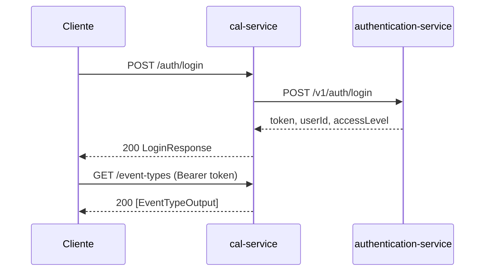
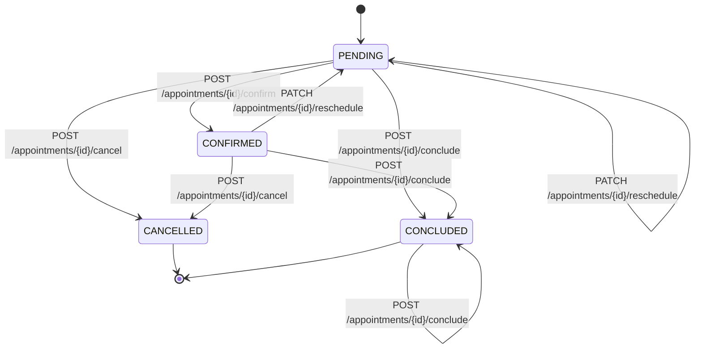

# Guia Completo de Integracao da API - cal-service

Guia de consumo para front-end e outros microservicos, com foco em integracao pratica endpoint por endpoint.

---

## 1. Inicio rapido

1. Obtenha token em `POST /auth/login`.
2. Envie `Authorization: Bearer <token>` nas chamadas protegidas.
3. Consulte Swagger em `GET /swagger-ui` e OpenAPI em `GET /api-docs`.

Base URL (exemplo local): `http://localhost:8080`

---

## 2. Visao geral visual

### 2.1 Arquitetura de consumo



### 2.2 Fluxo de autenticacao e consumo



### 2.3 Ciclo de vida de agendamento



---

## 3. Padroes globais de integracao

### 3.1 Headers

- `Content-Type: application/json`
- `Authorization: Bearer <token>` (endpoints protegidos)

### 3.2 Datas e horas

Formato aceito: ISO-8601

Exemplos validos:
- `2026-04-10T14:00:00`
- `2026-04-10T14:00:00Z`
- `2026-04-10T14:00:00-03:00`

### 3.3 Paginacao (`GET /appointments`)

- `page`: padrao `0`, minimo `0`
- `size`: padrao `20`, intervalo `1..100`

### 3.4 Contrato padrao de erro (`ApiErrorResponse`)

```json
{
  "timestamp": "2026-04-18T14:30:00Z",
  "status": 422,
  "code": "CORE-VALIDATION",
  "message": "Dados invalidos na requisicao.",
  "path": "/appointments",
  "severity": "WARN",
  "violations": [
    {
      "field": "startDateTime",
      "message": "startDateTime e obrigatorio",
      "code": "NotNull"
    }
  ]
}
```

---

## 4. Modulo Auth (`/auth`)

### AUTH-01 - POST `/auth/login`

**Objetivo:** autenticar usuario e obter JWT.

**Autenticacao:** publica.

**Request body**

| Campo | Tipo | Obrigatorio | Regra |
|---|---|---|---|
| email | string | Sim | nao vazio |
| password | string | Sim | nao vazio |

**Exemplo request**

```json
{
  "email": "usuario@empresa.com",
  "password": "senha"
}
```

**Response 200 (sucesso)**

```json
{
  "token": "<jwt>",
  "userId": 42,
  "accessLevel": "ADMIN"
}
```

**Erros comuns**

| HTTP | Codigo esperado | Quando ocorre |
|---|---|---|
| 401 | CORE-UNAUTHORIZED (ou equivalente) | credenciais invalidas |
| 502 | AUTH-GATEWAY-FAILED | falha no authentication-service |

**Observacoes importantes**

- O token retornado deve ser armazenado de forma segura.
- Em `prod`, sem token valido, endpoints de negocio retornam 401.

---

### AUTH-02 - POST `/auth/validate-token`

**Objetivo:** validar token e obter identidade basica.

**Autenticacao:** publica.

**Request body**

| Campo | Tipo | Obrigatorio | Regra |
|---|---|---|---|
| token | string | Sim | nao vazio |

**Exemplo request**

```json
{
  "token": "<jwt>"
}
```

**Response 200 (sucesso)**

```json
{
  "email": "usuario@penelope.com.br",
  "accessLevel": "ADMIN"
}
```

**Erros comuns**

| HTTP | Codigo esperado | Quando ocorre |
|---|---|---|
| 400 | CORE-VALIDATION | token ausente/vazio |
| 502 | AUTH-GATEWAY-FAILED | falha no authentication-service |

**Observacoes importantes**

- Ideal para validacao de sessao em gateways/BFF.

---

## 5. Modulo Event Types (`/event-types`)

### EVT-01 - POST `/event-types`

**Objetivo:** criar tipo de evento no Cal.com e persistir vinculo local.

**Autenticacao:** obrigatoria (`Bearer`).

**Request body**

| Campo | Tipo | Obrigatorio | Regra |
|---|---|---|---|
| title | string | Sim | 3 a 100 caracteres |
| description | string | Nao | max 500 |
| lengthInMinutes | integer | Nao | > 0 |
| minimumBookingNotice | integer | Nao | >= 0 |
| hidden | boolean | Nao | default false |
| estateId | long | Sim | nao nulo |

**Exemplo request**

```json
{
  "title": "Visita ao Empreendimento Parque das Flores",
  "description": "Visita presencial ao empreendimento",
  "lengthInMinutes": 60,
  "minimumBookingNotice": 120,
  "hidden": false,
  "estateId": 42
}
```

**Response 201 (sucesso)**

Headers:
- `Location: /event-types/{id}`

Body (`EventTypeOutput`):

```json
{
  "id": 123,
  "title": "Visita ao Empreendimento Parque das Flores",
  "slug": "visita-ao-empreendimento-parque-das-flores",
  "description": "Visita presencial ao empreendimento",
  "lengthInMinutes": 60,
  "minimumBookingNotice": 120,
  "hidden": false,
  "estateId": 42
}
```

**Erros comuns**

| HTTP | Codigo esperado | Quando ocorre |
|---|---|---|
| 422 | CORE-VALIDATION / ET-VAL-* | payload invalido |
| 401 | CORE-UNAUTHORIZED | sem token/invalid token |
| 502 | ET-CREATION-FAILED | erro na integracao externa |

**Observacoes importantes**

- `slug` e gerado automaticamente a partir de `title`.
- Campos nulos opcionais seguem defaults internos.

---

### EVT-02 - GET `/event-types/{eventTypeId}`

**Objetivo:** buscar tipo de evento por ID.

**Autenticacao:** obrigatoria.

**Path params**

| Param | Tipo | Obrigatorio |
|---|---|---|
| eventTypeId | long | Sim |

**Response 200 (sucesso)**

```json
{
  "id": 123,
  "title": "Visita ao Empreendimento Parque das Flores",
  "slug": "visita-ao-empreendimento-parque-das-flores",
  "description": "Visita presencial",
  "lengthInMinutes": 60,
  "minimumBookingNotice": 120,
  "hidden": false,
  "estateId": null
}
```

**Erros comuns**

| HTTP | Codigo esperado | Quando ocorre |
|---|---|---|
| 404 | ET-NOT-FOUND | ID inexistente |
| 401 | CORE-UNAUTHORIZED | sem token/invalid token |

**Observacoes importantes**

- Endpoint usa integracao de leitura com provedor externo.

---

### EVT-03 - GET `/event-types`

**Objetivo:** listar tipos de evento de forma paginada.

**Autenticacao:** obrigatoria.

**Query params**

| Param | Tipo | Obrigatorio | Regra |
|---|---|---|---|
| page | integer | Nao | >= 0 (padrao 0) |
| size | integer | Nao | > 0 (padrao 20) |

**Exemplo request**

`GET /event-types?page=0&size=20`

**Response 200 (sucesso)**

Objeto paginado com metadados e lista em `content`:

```json
{
  "content": [
    {
      "id": 123,
      "title": "Visita ao Empreendimento Parque das Flores",
      "slug": "visita-ao-empreendimento-parque-das-flores",
      "description": "Visita presencial",
      "lengthInMinutes": 60,
      "minimumBookingNotice": 120,
      "hidden": false,
      "estateId": null
    }
  ],
  "page": 0,
  "size": 20,
  "totalElements": 1,
  "totalPages": 1
}
```

**Erros comuns**

| HTTP | Codigo esperado | Quando ocorre |
|---|---|---|
| 401 | CORE-UNAUTHORIZED | sem token/invalid token |

**Observacoes importantes**

- `200` com `content: []` e comportamento esperado quando nao houver dados.

---

### EVT-04 - PATCH `/event-types/{eventTypeId}`

**Objetivo:** atualizar parcialmente tipo de evento.

**Autenticacao:** obrigatoria.

**Path params**

| Param | Tipo | Obrigatorio |
|---|---|---|
| eventTypeId | long | Sim |

**Request body**

| Campo | Tipo | Obrigatorio | Regra |
|---|---|---|---|
| title | string | Nao | 3 a 100 |
| description | string | Nao | max 500 |
| lengthInMinutes | integer | Nao | > 0 |
| minimumBookingNotice | integer | Nao | >= 0 |

**Exemplo request**

```json
{
  "description": "Descricao atualizada",
  "lengthInMinutes": 45
}
```

**Response 200 (sucesso)**

`EventTypeOutput` atualizado.

**Erros comuns**

| HTTP | Codigo esperado | Quando ocorre |
|---|---|---|
| 404 | ET-NOT-FOUND | nao encontrado localmente |
| 422 | CORE-VALIDATION | payload invalido |
| 401 | CORE-UNAUTHORIZED | sem token/invalid token |
| 502 | ET-UPDATE-FAILED | erro em Cal.com |

**Observacoes importantes**

- Operacao sincroniza banco local e sistema externo.

---

### EVT-05 - PATCH `/event-types/{eventTypeId}/toggle-visibility`

**Objetivo:** alternar `hidden` (visivel/oculto).

**Autenticacao:** obrigatoria.

**Request body:** nao possui.

**Response 200 (sucesso)**

`EventTypeOutput` com `hidden` atualizado.

**Erros comuns**

| HTTP | Codigo esperado | Quando ocorre |
|---|---|---|
| 404 | ET-NOT-FOUND | nao encontrado |
| 401 | CORE-UNAUTHORIZED | sem token/invalid token |
| 502 | ET-UPDATE-FAILED | erro em Cal.com |

**Observacoes importantes**

- Endpoint ideal para habilitar/desabilitar sem alterar metadados.

---

### EVT-06 - DELETE `/event-types/{eventTypeId}`

**Objetivo:** excluir tipo de evento.

**Autenticacao:** obrigatoria.

**Response 204 (sucesso)**

Sem body.

**Erros comuns**

| HTTP | Codigo esperado | Quando ocorre |
|---|---|---|
| 404 | ET-NOT-FOUND | nao encontrado |
| 401 | CORE-UNAUTHORIZED | sem token/invalid token |
| 502 | ET-DELETION-FAILED | falha em integracao externa |

**Observacoes importantes**

- Considere confirmar impacto no front antes de excluir.

---

## 6. Modulo Appointments (`/appointments`)

### APT-01 - POST `/appointments`

**Objetivo:** criar agendamento.

**Autenticacao:** obrigatoria.

**Request body**

| Campo | Tipo | Obrigatorio | Regra |
|---|---|---|---|
| eventTypeId | long | Sim | nao nulo |
| clientId | long | Sim | nao nulo |
| estateAgentId | long | Sim | nao nulo |
| startDateTime | string | Sim | ISO-8601 |
| endDateTime | string | Sim | ISO-8601 |
| attendeeName | string | Sim (regra de negocio) | nao vazio |
| attendeeEmail | string | Sim (regra de negocio) | nao vazio |
| notes | string | Nao | livre |

**Exemplo request**

```json
{
  "eventTypeId": 100,
  "clientId": 10,
  "estateAgentId": 20,
  "startDateTime": "2026-04-10T14:00:00",
  "endDateTime": "2026-04-10T15:00:00",
  "attendeeName": "Maria Silva",
  "attendeeEmail": "maria@email.com",
  "notes": "Primeira visita ao empreendimento"
}
```

**Response 201 (sucesso)**

Headers:
- `Location: /appointments/{id}`

Body (`AppointmentOutput`):

```json
{
  "id": 1,
  "bookingUid": "bk_abc123",
  "eventTypeId": 100,
  "clientId": 10,
  "estateAgentId": 20,
  "durationMinutes": 60,
  "status": "PENDING",
  "startDateTime": "2026-04-10T14:00:00",
  "endDateTime": "2026-04-10T15:00:00",
  "attendeeName": "Maria Silva",
  "attendeeEmail": "maria@email.com",
  "notes": "Primeira visita ao empreendimento",
  "reason": null,
  "createdAt": "2026-03-22T10:00:00",
  "updatedAt": "2026-03-22T10:00:00"
}
```

**Erros comuns**

| HTTP | Codigo esperado | Quando ocorre |
|---|---|---|
| 422 | CORE-VALIDATION / APPT-VAL-* | payload invalido |
| 401 | CORE-UNAUTHORIZED | sem token/invalid token |
| 502 | APT-BOOKING-CREATE-FAILED | falha ao criar booking externo |

**Observacoes importantes**

- Mesmo se DTO permitir `attendeeName`/`attendeeEmail` nulos, regra de negocio exige os campos.

---

### APT-02 - GET `/appointments/{id}`

**Objetivo:** buscar agendamento por ID local.

**Autenticacao:** obrigatoria.

**Path params**

| Param | Tipo | Obrigatorio |
|---|---|---|
| id | long | Sim |

**Response 200 (sucesso)**

`AppointmentOutput`.

**Erros comuns**

| HTTP | Codigo esperado | Quando ocorre |
|---|---|---|
| 404 | APT-NOT-FOUND | ID inexistente |
| 401 | CORE-UNAUTHORIZED | sem token/invalid token |

**Observacoes importantes**

- Este endpoint consulta estado local persistido.

---

### APT-03 - GET `/appointments`

**Objetivo:** listar com filtros e paginacao.

**Autenticacao:** obrigatoria.

**Query params**

| Param | Tipo | Obrigatorio | Regra |
|---|---|---|---|
| clientId | long | Nao | filtro |
| estateAgentId | long | Nao | filtro |
| estateId | long | Nao | filtro |
| status | string | Nao | `PENDING`, `CONFIRMED`, `CONCLUDED`, `CANCELLED` |
| startDateTime | string | Nao | ISO-8601 |
| endDateTime | string | Nao | ISO-8601 |
| page | integer | Nao | >= 0 (padrao 0) |
| size | integer | Nao | 1..100 (padrao 20) |

**Exemplo request**

`GET /appointments?estateId=30&status=PENDING&page=0&size=20`

**Response 200 (sucesso)**

```json
{
  "appointments": [
    {
      "id": 1,
      "bookingUid": "bk_abc123",
      "eventTypeId": 100,
      "clientId": 10,
      "estateAgentId": 20,
      "durationMinutes": 60,
      "status": "PENDING",
      "startDateTime": "2026-04-10T14:00:00",
      "endDateTime": "2026-04-10T15:00:00",
      "attendeeName": "Maria Silva",
      "attendeeEmail": "maria@email.com",
      "notes": "Primeira visita",
      "reason": null,
      "createdAt": "2026-03-22T10:00:00",
      "updatedAt": "2026-03-22T10:00:00"
    }
  ],
  "page": 0,
  "size": 20,
  "totalElements": 1,
  "totalPages": 1
}
```

**Erros comuns**

| HTTP | Codigo esperado | Quando ocorre |
|---|---|---|
| 422 | APPT-VAL-PAGE-INVALID, APPT-VAL-SIZE-INVALID, APPT-VAL-STATUS-INVALID | query invalida |
| 401 | CORE-UNAUTHORIZED | sem token/invalid token |

**Observacoes importantes**

- Envie `status` em caixa alta para evitar rejeicao.

---

### APT-04 - PATCH `/appointments/{id}/reschedule`

**Objetivo:** reagendar horario de um agendamento nao terminal.

**Autenticacao:** obrigatoria.

**Request body**

| Campo | Tipo | Obrigatorio | Regra |
|---|---|---|---|
| startDateTime | string | Sim | ISO-8601 |
| endDateTime | string | Sim | ISO-8601 e posterior ao inicio |
| reason | string | Nao | motivo do reagendamento |

**Exemplo request**

```json
{
  "startDateTime": "2026-04-12T16:00:00",
  "endDateTime": "2026-04-12T17:30:00",
  "reason": "Conflito de agenda"
}
```

**Response 200 (sucesso)**

`AppointmentOutput` atualizado.

**Erros comuns**

| HTTP | Codigo esperado | Quando ocorre |
|---|---|---|
| 404 | APT-NOT-FOUND | agendamento inexistente |
| 409 | APT-INVALID-STATUS-TRANSITION | status terminal |
| 422 | APPT-VAL-START-DT-INVALID / APPT-VAL-END-DT-INVALID | data/hora invalida |
| 502 | APT-BOOKING-RESCHEDULE-FAILED | falha na integracao externa |

**Observacoes importantes**

- Reagendamento nao e permitido quando status ja for terminal.

---

### APT-05 - POST `/appointments/{id}/cancel`

**Objetivo:** cancelar agendamento.

**Autenticacao:** obrigatoria.

**Request body** (opcional)

| Campo | Tipo | Obrigatorio |
|---|---|---|
| reason | string | Nao |

**Exemplo request**

```json
{
  "reason": "Cliente desistiu da visita"
}
```

**Response 200 (sucesso)**

`AppointmentOutput` com `status = CANCELLED`.

**Erros comuns**

| HTTP | Codigo esperado | Quando ocorre |
|---|---|---|
| 404 | APT-NOT-FOUND | agendamento inexistente |
| 409 | APT-INVALID-STATUS-TRANSITION | status terminal |
| 502 | APT-BOOKING-CANCEL-FAILED | falha na integracao externa |

**Observacoes importantes**

- Body pode ser omitido completamente.

---

### APT-06 - POST `/appointments/{id}/confirm`

**Objetivo:** confirmar agendamento.

**Autenticacao:** obrigatoria.

**Request body:** nao possui.

**Response 200 (sucesso)**

`AppointmentOutput` com `status = CONFIRMED`.

**Erros comuns**

| HTTP | Codigo esperado | Quando ocorre |
|---|---|---|
| 404 | APT-NOT-FOUND | agendamento inexistente |
| 409 | APT-INVALID-STATUS-TRANSITION | status terminal |
| 401 | CORE-UNAUTHORIZED | sem token/invalid token |

**Observacoes importantes**

- Operacao bloqueada quando status ja for `CANCELLED` ou `CONCLUDED`.

---

### APT-07 - POST `/appointments/{id}/conclude`

**Objetivo:** concluir agendamento.

**Autenticacao:** obrigatoria.

**Request body:** nao possui.

**Response 200 (sucesso)**

`AppointmentOutput` com `status = CONCLUDED`.

**Erros comuns**

| HTTP | Codigo esperado | Quando ocorre |
|---|---|---|
| 404 | APT-NOT-FOUND | agendamento inexistente |
| 409 | APT-INVALID-STATUS-TRANSITION | status `CANCELLED` |
| 401 | CORE-UNAUTHORIZED | sem token/invalid token |

**Observacoes importantes**

- Regra de dominio bloqueia conclusao apenas se status atual for `CANCELLED`.

---

### APT-08 - DELETE `/appointments/{id}`

**Objetivo:** excluir agendamento local e cancelar remoto quando aplicavel.

**Autenticacao:** obrigatoria.

**Request body:** nao possui.

**Response 204 (sucesso)**

Sem body.

**Erros comuns**

| HTTP | Codigo esperado | Quando ocorre |
|---|---|---|
| 404 | APT-NOT-FOUND | agendamento inexistente |
| 401 | CORE-UNAUTHORIZED | sem token/invalid token |
| 502 | APT-BOOKING-CANCEL-FAILED | falha no cancelamento remoto |

**Observacoes importantes**

- Se houver `bookingUid`, a API tenta cancelar no provedor antes de remover localmente.

---

## 7. Exemplo de integracao (front-end TypeScript)

```ts
const API_BASE = 'http://localhost:8080';

export async function login(email: string, password: string) {
  const res = await fetch(`${API_BASE}/auth/login`, {
    method: 'POST',
    headers: { 'Content-Type': 'application/json' },
    body: JSON.stringify({ email, password })
  });

  if (!res.ok) throw await res.json();
  return res.json();
}

export async function createAppointment(token: string, payload: unknown) {
  const res = await fetch(`${API_BASE}/appointments`, {
    method: 'POST',
    headers: {
      'Content-Type': 'application/json',
      Authorization: `Bearer ${token}`
    },
    body: JSON.stringify(payload)
  });

  if (!res.ok) throw await res.json();
  return res.json();
}
```

---

## 8. Exemplo de integracao (microservico Java)

```java
import org.springframework.http.HttpHeaders;
import org.springframework.http.MediaType;
import org.springframework.web.client.RestClient;

public class CalServiceClient {

  private final RestClient restClient;

  public CalServiceClient(String baseUrl, String token) {
    this.restClient = RestClient.builder()
      .baseUrl(baseUrl)
      .defaultHeader(HttpHeaders.CONTENT_TYPE, MediaType.APPLICATION_JSON_VALUE)
      .defaultHeader(HttpHeaders.AUTHORIZATION, "Bearer " + token)
      .build();
  }

  public String listEventTypes() {
    return restClient.get()
      .uri("/event-types")
      .retrieve()
      .body(String.class);
  }
}
```

---

## 9. Observacoes criticas para integracao completa

- Em `prod`, considere token expirado como fluxo normal e trate renovacao automaticamente.
- Trate `409` como regra de negocio (nao retry cego).
- Trate `502` com retry exponencial e circuit breaker.
- Sempre logue `code`, `status` e `path` do erro para troubleshooting.
- Gere cliente tipado a partir de `GET /api-docs` quando possivel.

---

## 10. Referencias

- Swagger UI: `GET /swagger-ui`
- OpenAPI JSON: `GET /api-docs`
- Contrato de erro: `ApiErrorResponse`
- Controllers de referencia:
  - `AuthController`
  - `EventTypeController`
  - `AppointmentController`
